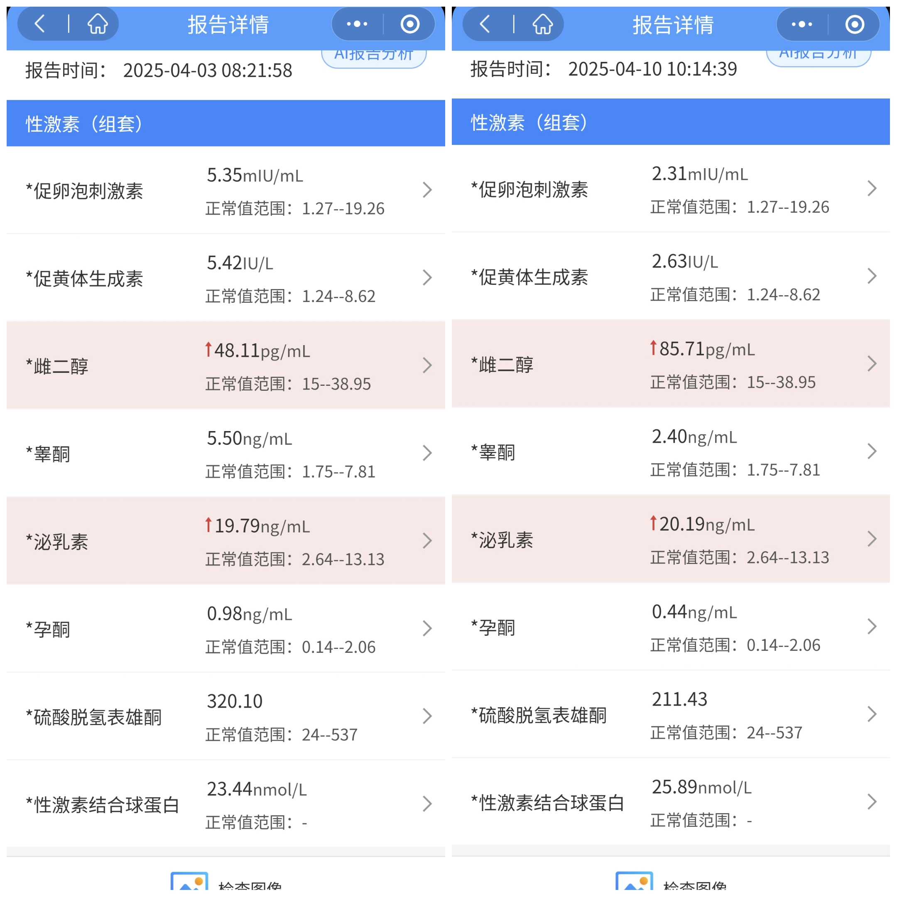
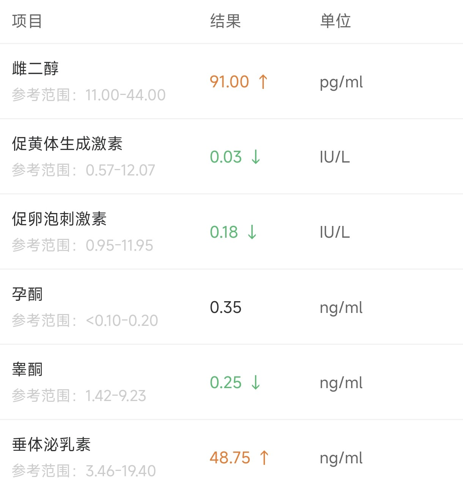
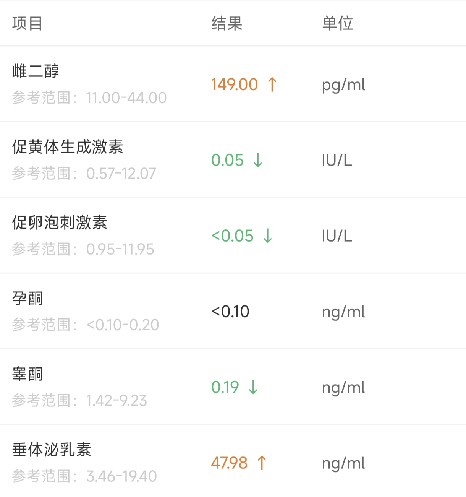

# 这是一个HRT记录帖

emm，需要先来介绍一下自己嘛...  
懒了，不写了（x）  

在（4/3的上一个周三）开到病历之后过了一个星期就去医院做了HRT之前的激素检查（左边那个）。比较意外的收获了一个原本就偏高的雌二醇水平以及不知道为什么也很高的泌乳素水平。猜测可能由于泌乳素是应激激素，受到近期精神状态的影响导致。前者就不太清楚了，也说不上是好还是坏。

然后，星期天，开始吃糖了。 ~~也是成为xyn了呢（划掉）~~

右边是吃了四天每天3次1mg的补佳乐以及一天一次1/4片的12.5mg色之后的复查报告，可以看出睾酮值以及两种促激素已经有了明显的下降。实际上前期CPA可以等到激素水平稳定之后再逐渐减量到12.5，像一开始就用这个量无非掉的慢一点。不过一天3mg的补似乎不是太够，不清楚是否和含服的给药方式有关。  

值得一提的是，开始含糖之后并没有出现预期的情绪波动，精神状况似乎还有所改善了（？）星宇还是一如既往的没有（实际上去心理科的一个契机也就是因为这个察觉到不太对劲）。体力下降之类的现象应该出现的比较慢，这两天可能是因为天气逐渐暖起来了，人本来就比较虚吧。

无论通过什么方式，也逐渐有了零星的同学和朋友知道了我吃药的事情，好在大家比较友善（其实是废话，那些不愿意看到的人也不会让这些人知道的）。总之还是希望往后的生活可以不用再为自己身体上出现的那些讨厌的现象所困扰了。

>以上写于2025/4/11

昨天又去了一次医院，这次换了离学校（机厅）都更近的另一家医院，报告当天就出来了，就是排队比较长。 ~~因为去医院的次数太多疑似把医保刷穿了。~~ 不过指标看起来已经比较理想了，下次可以晚一点再去。今天把第二板糖吃完，感觉还是得找时间去苏州开一张处方，以及把大证开出来。

因为上次测得的E2虽然接近但并未达到理想水平，因此在原有基础上加了睡觉前的每天一次1mg补佳乐吞服，不过好像对指标影响不大。感觉服药方式之类的还需要长期观察。 ~~什么时候脸上的毛发才能消失呢...~~

>以上写于2025/4/17

这是23号的检验报告。22号翘课去结果还是排队，等到轮到我把检查开出来，检验科已经下班了，只能第二天再去。这次是含服之后较短时间测的，一天四次含服的E2水平也没有特别高，可以考虑换日雌，毕竟便宜一点，效果也好。

值得一提的是，这次检查之前一天和当天都没有吃色（检查完晚上吃了），所以两天12.5mg应当是足够压住的。

>以上写于2025/4/27

在五一之前速通了大证。医生人很好，不知道以后还会不会再遇到了。心理科两次就诊的费用加起来还没一次六项多（实际上也就两次挂号加上一组量表的费用）。

换日雌之后测了两次六项，第一次是打完第三天测的，E2>1000pg/ml 就没具体数字了，第二次是下次注射前一天下午测的，谷值大约在 200pg/ml 左右。泌乳素倒是掉回含糖之前的水平了，估计是停了色的缘故。打针似乎还把我的情绪低落也打好了（笑）。

日雌确实劲大，现在乳头日常充血（不知道和打日雌有没有关系就是了），会发情倒是真的。压到会疼。（这段话的主谓关系好像有点混乱，挺有意思。）

图暂时懒得放了。星期六看看去苏州能不能把处方开出来。说实话就现在的样子还完全不够作为一只合格xyn的，还得想想办法。

可能要记得把之前写的内容格式改一下，中英文之间要记得加空格。

> 以上写于2025/5/22
